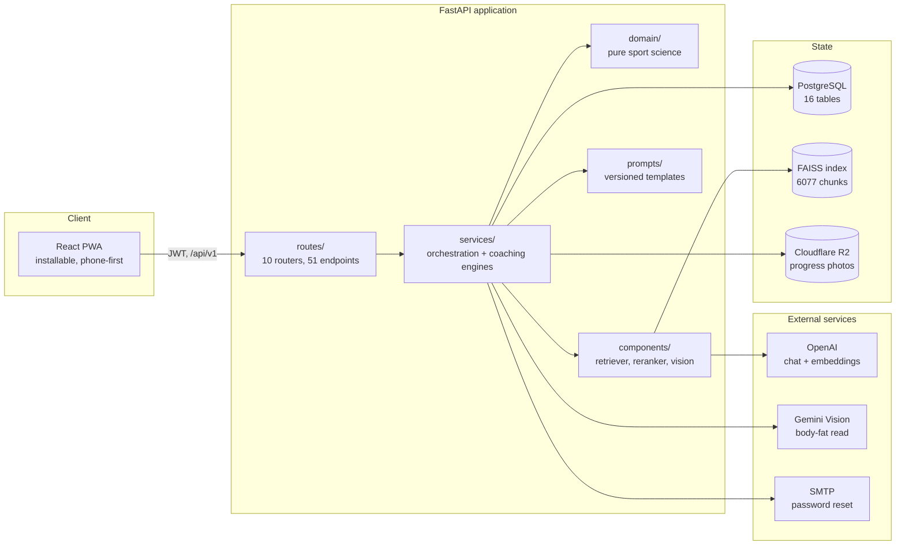
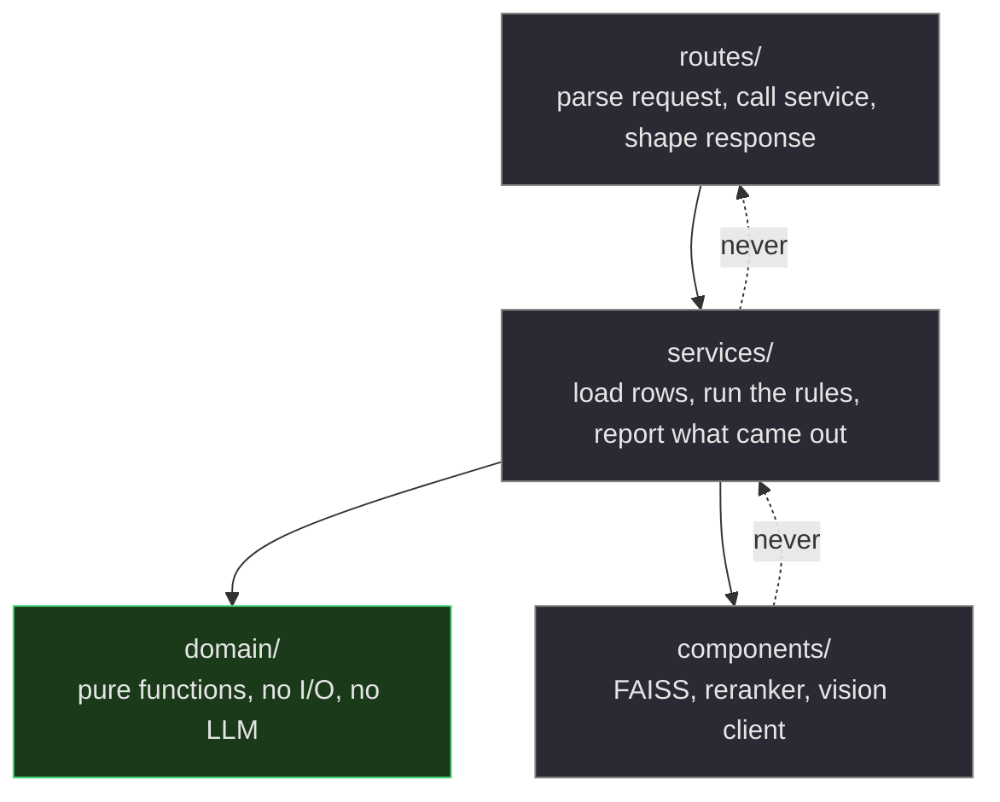
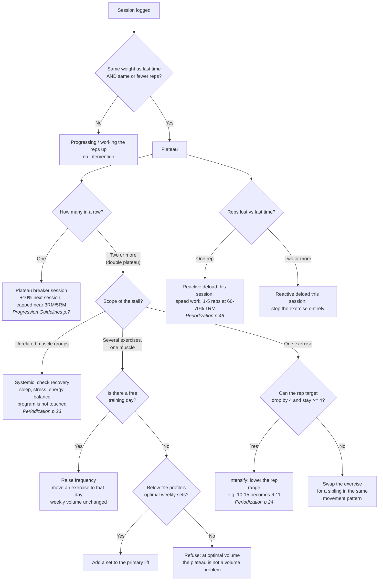
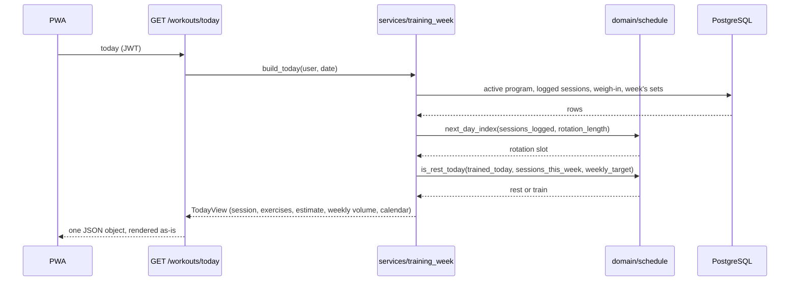
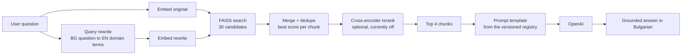
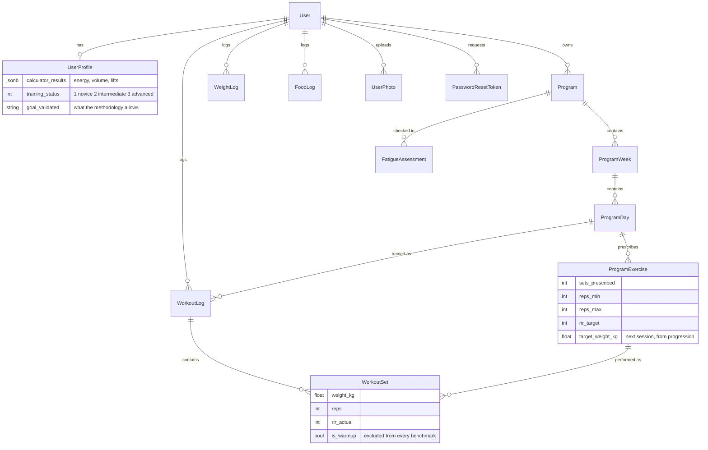

# Cybernetic Gym Assistant

A personal AI strength coach built on the **Menno Henselmans PT Certification** methodology.
It designs the training program, decides what to train today, detects plateaus, prescribes the
course's own technique for breaking them, tracks nutrition and body composition, and answers
questions grounded in the course material.

The interesting part is not that it calls an LLM. It is **where it refuses to**.

```
FastAPI · async SQLAlchemy · PostgreSQL · OpenAI · FAISS · React 19 · TypeScript · Tailwind 4 · PWA
```

---

## Table of contents

- [The design principle](#the-design-principle)
- [What it does](#what-it-does)
- [System architecture](#system-architecture)
- [Layering and dependency rules](#layering-and-dependency-rules)
- [The coaching engine](#the-coaching-engine)
- [The RAG pipeline](#the-rag-pipeline)
- [Retrieval evaluation](#retrieval-evaluation)
- [Data model](#data-model)
- [API surface](#api-surface)
- [Frontend](#frontend)
- [Testing strategy](#testing-strategy)
- [Security](#security)
- [Getting started](#getting-started)
- [Project layout](#project-layout)
- [Engineering decisions](#engineering-decisions)
- [Roadmap](#roadmap)

---

## The design principle

Most "AI fitness app" demos ask a model to decide how much you should eat and how hard you
should train. That is the one thing a language model should not be doing: the answer is a
calculation from a published methodology, it has to be identical for identical inputs, and the
user deserves to know why it came out that way.

This project draws a hard line:

| Question | Answered by | Example |
| --- | --- | --- |
| Is the rule known? | plain Python, no model | energy intake, 1RM, optimal weekly volume, plateau detection |
| Is the input unstructured language or an image? | a pretrained model | free-text food logging, body-fat photo assessment, the coach chat |
| Does the model need private knowledge? | RAG over the course corpus | every coaching explanation |

The consequence runs through the whole codebase: **`domain/` is pure functions, and the LLM is
never allowed to recompute a number that lives there.** It may explain one, never override it.
Every threshold in `domain/` carries the page of the course material it came from.

---

## What it does

- **Onboarding** - a 16-step intake modelled on the Henselmans coaching intake form, including
  a body-fat estimate from photos against the course's visual reference guide.
- **Program generation** - the split is chosen by rule (a model is not allowed to pick one that
  breaks the "every muscle at least twice a week" constraint), the exercises are generated, and
  the result is verified against the rule before it is stored.
- **Today** - which session is next, what to lift, and what the weekly volume looks like so far.
  Decided entirely on the backend so the client cannot drift from it.
- **Progression** - the next session's load, from the first work set of the last one.
- **Plateau engine** - detects a stall and prescribes the course's technique for the stage it
  has reached, then applies it to the program on request. See [the coaching engine](#the-coaching-engine).
- **Deload decisions** - a weekly check-in scored deterministically, worded by the LLM.
- **Nutrition** - free-text food logging parsed into macros, with USDA-backed numbers marked
  differently from model estimates.
- **Weight trend** - EWMA smoothing plus a calorie adjustment against the goal's target rate.
- **Coach chat** - questions answered from retrieved course context, not from the model's
  general knowledge.

---

## System architecture



Everything the client renders is decided server-side. The frontend holds no coaching logic at
all - it fetches a decision and draws it. Two implementations of the same rule are two rules.

---

## Layering and dependency rules



- **`domain/`** holds the rules and nothing else. No database, no network, no model. This is what
  makes the coaching decisions testable as pure functions and identical on every run.
- **`services/`** supply the rules with rows and report the result. They decide nothing on their
  own.
- **`components/`** are single-responsibility infrastructure: the retriever owns the FAISS index
  and embeddings, the reranker owns the cross-encoder, neither knows what a program is.
- **`prompts/`** are versioned behind a registry (`get_prompt("name")`). A shipped prompt version
  is never edited in place; `_v2` is added beside `_v1` and the registry switches.

---

## The coaching engine

The part of the system worth reading. Every branch below is a pure function over the logged sets,
and every threshold cites the course page it comes from.

**Progress is measured on the first work set of a session.** Later sets are fatigued and say more
about work capacity than strength, so the course benchmarks the first one, and so does this code.



Three details that matter more than the diagram:

1. **A first plateau never changes the program.** The course is explicit that a single stall has
   many causes; only a double plateau at the same strength level justifies rebuilding anything.
2. **Raising frequency moves an exercise rather than adding one**, so weekly volume stays exactly
   where it was and frequency is the only variable that changed.
3. **Adding sets stops at the profile's optimal weekly volume.** Past that point more sets are
   fatigue, not stimulus, and the honest answer is that the plateau is not about volume.

When the user applies a verdict, the change is written to **every week of the program**, because
a generated program is one template week repeated and the training rotation is served from the
first week. A change that skipped week 1 would never reach the session actually being trained.

### What "today" means



A program is a **rotation, not a weekday timetable**. Miss Monday and you have not missed "leg
day"; the next session is still the next session. Claiming otherwise would be an invention the
data does not support.

---

## The RAG pipeline

The course material (PDF, DOCX, XLSX) is extracted, chunked and embedded into a FAISS index of
6077 chunks. Retrieval is the only source of coaching knowledge in generated text.



The corpus is English and the user writes Bulgarian, which is why the rewrite step exists: it
translates the question into the vocabulary the corpus actually uses, and both variants are
searched so a bad rewrite cannot lose the original hit.

**Every stage degrades loudly.** A missing index, a failed embedding or an unavailable reranker
logs a warning and falls back to a documented behaviour instead of failing the request. Nothing
silently returns an empty context and pretends the answer is grounded.

---

## Retrieval evaluation

Retrieval changes are measured, not guessed at. `evaluation/offline_eval.py` runs the real
pipeline over a 30-question golden dataset and scores four RAGAS-style metrics with an LLM judge.
Runs are written to `evaluation/results/` so two of them can be compared with the retrieval
change as the only variable. They stay out of the repository: each result file embeds the
retrieved course passages next to the scores, and the course material is copyrighted.

| Metric | Baseline (dual retrieval) | With query rewriting | Delta |
| --- | --- | --- | --- |
| Faithfulness | 0.815 | 0.828 | +0.013 |
| Answer relevancy | 0.970 | 0.937 | -0.033 |
| Context precision | 0.687 | 0.627 | -0.060 |
| Context recall | 0.474 | 0.544 | **+0.070** |
| Aggregate | 0.736 | 0.734 | -0.002 |

The aggregate is flat, and reporting it as a win would be dishonest. Rewriting was kept on for a
stated reason: **recall is the binding constraint here**. A chunk that is never retrieved cannot
be cited, while a slightly noisier context is something the generation step tolerates - which is
what the faithfulness number shows.

---

## Data model



16 tables in total. Two modelling decisions worth calling out:

- **The log is history, the program is a plan.** A `WorkoutSet` carries its own exercise name, so
  swapping an exercise in the program never rewrites what was already lifted.
- **The exercise library is not a table.** 147 exercises in 21 movement patterns are parsed from
  the course guide at runtime and cached in memory. It is static reference content nobody edits,
  and a table would need a migration and a seed step to hold exactly the same rows.

---

## API surface

51 endpoints across 10 routers, all under `/api/v1`, all JWT-authenticated except registration
and login.

| Router | Endpoints | Notable |
| --- | --- | --- |
| `auth` | 6 | register, login, forgot/reset/change password, me |
| `profile` | 4 | intake, recalculate the deterministic numbers, nutrition targets |
| `programs` | 14 | generate, review, extend, archive, swap/intensify/adjust |
| `workouts` | 6 | today, log a session, strength progression, week summary |
| `weight` | 4 | log, trend, coaching adjustment |
| `food` | 3 | free-text logging, daily totals |
| `exercises` | 3 | library, categories, alternatives |
| `photos` | 4 | upload to R2, body-fat assessment |
| `chat` | 3 | grounded coach, history |
| `notifications` | 4 | generate, read, read-all |

The three endpoints that carry the coaching engine:

```http
GET  /api/v1/programs/{id}/review              # verdict + per-exercise technique, decided deterministically
POST /api/v1/programs/{id}/exercises/intensify # lower the rep range across every week
POST /api/v1/programs/{id}/muscles/adjust      # frequency first, sets second, capped at optimal volume
```

Errors are Bulgarian sentences a user can act on, produced centrally in `core/errors.py`, with a
`fields` list on validation failures so a form can mark the exact inputs.

---

## Frontend

React 19 + TypeScript + Vite + Tailwind 4 + TanStack Query, installable as a PWA, feature-based:

```
src/
  components/     design system (ui/) and layout shells
  constants/      navigation, storage keys, history windows, calendar, auth rules
  features/       auth, onboarding, programs, workouts, nutrition, progress, coach, photos
  pages/          16 screens, one per route
  services/       HTTP client (timeouts, 401 handling), toast store
  utils/          formatting, dates, pure helpers
```

Points of interest:

- **The client decides nothing.** Every coaching number arrives from the API. The frontend's job
  is to render it and to be honest about what it does not know.
- **One error channel per failure type.** A failed query renders in place with a retry, because
  the screen has no data to show. A failed mutation raises a toast, unless losing the message
  would lose work (a 16-step form, a logged session), in which case it stays on screen. The rule
  is stated once, in `main.tsx`, and enforced by a mutation-cache handler.
- **Requests time out.** 15 seconds by default, 120 for the endpoints that wait on a model, with
  distinct messages for "no connection" and "no answer in time" - the two cases the backend by
  definition cannot answer.
- **The design system is closed.** Tokens, spacing and components come from a fixed vocabulary;
  anything invented outside it is rejected in review.

---

## Testing strategy

204 tests, in two deliberately separate suites.

| Suite | Count | Runs on | What it proves |
| --- | --- | --- | --- |
| Pure | 164 | nothing | the coaching rules: plateau detection, technique selection, deload thresholds, split rules, calculators, progression, weight trend |
| Integration | 40 | real PostgreSQL | which rows a query picks, that a change reaches every week, and who is allowed to touch what |

The tests assert **intent, not arithmetic**. `test_raising_frequency_keeps_the_weekly_sets_where_they_were`
fails if the coaching rule is inverted; a test that only checks a function returns `102.5` would
not. Thresholds are imported from the module they live in, so retuning a constant changes the
rule instead of silently invalidating what the test claims.

The integration suite runs each test inside a transaction that is rolled back, with
`join_transaction_mode="create_savepoint"`, so services can commit exactly as they do in
production and still leave no rows behind. With no database reachable the package skips with a
reason instead of failing, and the pure suite still runs anywhere.

```bash
cd backend && python -m pytest              # everything
cd backend && python -m pytest tests/integration
cd frontend && npx tsc -b --noEmit && npx oxlint src && npm test && npm run build
```

---

## Security

- **Passwords**: bcrypt with a SHA-256 pre-hash, so a long passphrase is never silently truncated
  at bcrypt's 72-byte limit.
- **Reset tokens**: 32 random bytes, stored only as a SHA-256 hash, single use, one hour, and
  requesting a new link spends the previous one.
- **Enumeration**: `forgot-password` answers identically for registered and unknown addresses.
- **Object ownership**: rows are reached through the owning program, never by id alone. An id on
  its own says nothing about who owns it.
- **Sessions**: a rejected token ends the session immediately in the client rather than letting
  the user keep filling in forms that can no longer be saved.
- **Secrets**: everything through `core/config.py` and `.env`, which is git-ignored. No key, model
  name, path or threshold is hardcoded.

---

## Getting started

Requirements: Python 3.11+, PostgreSQL 14+, Node 20+, an OpenAI API key.

```bash
# Backend
cd backend
python -m venv venv && source venv/Scripts/activate
pip install -r requirements.txt
cp .env.example .env                 # fill in the real values
python -m alembic upgrade head
python -m scripts.healthcheck        # database, FAISS index, object storage
python -m uvicorn app.main:app --reload --port 8000
```

```bash
# Frontend
cd frontend
npm install
npm run dev                          # http://localhost:5173
```

```bash
# A populated demo account: 4 weeks of sessions, 60 days of weigh-ins, a stalled lift
cd backend && python -m scripts.seed_demo      # demo@example.com / demo12345
```

Interactive API docs at `http://localhost:8000/docs`.

---

## Project layout

```
backend/
  app/
    core/          config, security, shared LLM client, Bulgarian error handlers
    db/            async engine and session factory
    domain/        pure sport science: calculators, plateau, schedule, program design,
                   training volume, exercise library, body-fat reference
    components/    FAISS retriever, cross-encoder reranker, vision client
    services/      RAG pipeline, training week, progression, fatigue, weight trend,
                   program review and adjustment, storage, mailer
    prompts/       versioned templates behind a registry
    routes/        HTTP layer only
    models.py      16 SQLAlchemy tables
    schemas.py     Pydantic request/response contracts
  evaluation/      golden dataset, offline RAG eval (runs stay local)
  migrations/      Alembic
  scripts/         healthcheck, demo seed
  tests/           pure suite + integration/ (real PostgreSQL)
  notebooks/       prototypes: extraction, chunking, embeddings, agent experiments
  data/            extracted course material and FAISS index (git-ignored)
frontend/          React PWA
docs/              architecture notes
```

---

## Engineering decisions

| Decision | Why | What was rejected |
| --- | --- | --- |
| Coaching numbers in pure functions | identical output for identical input, testable without a database, explainable to the user | asking the LLM for macros and set counts |
| Thresholds cite a course page | a reviewer can check the rule against the source instead of trusting the code | tuned constants with no provenance |
| Plateau detected by repeated weight, not by a percentage | it is the course's own definition of progress, and it catches a permanently flat lift that a percentage rule reads as fine | a "sessions since best" counter, which a repeated personal best kept resetting |
| Verdicts applied to every week | the training rotation is served from week 1, so a partial write never reaches the session being trained | writing only to the weeks after the current one |
| Exercise library parsed at runtime | static reference content that nobody edits does not need a migration and a seed step | a database table |
| Prompts versioned behind a registry | prompt changes stay reviewable and reversible without touching business code | inline prompt strings in services |
| Query rewriting kept despite a flat aggregate | recall is the binding constraint for grounding, and the trade-off is stated rather than hidden behind one number | reporting the aggregate as an improvement |
| Integration tests on real PostgreSQL | the models use JSONB and UUID columns; a stand-in proves nothing about the queries that actually run | SQLite in memory |
| Toast for mutations, inline for queries | a screen with no data needs a retry in place; a failed action needs to be noticed without moving the eye | one error component everywhere |

---

## Roadmap

- Apply the remaining plateau technique (periodization blocks) as a program transformation.
- Coach chat: suggested questions and visible citations back to the course module.
- Sign in with Google, and stronger password rules.
- Weight-trend forecasting with an explicit uncertainty band, measured against the current EWMA
  baseline and kept only if it wins.
- A scheduler for notification generation, which is currently triggered by hand.

---

## Notes

- User-facing coaching text is Bulgarian. Exercise names stay standard English gym names, and
  weight is always kilograms.
- The course material in `backend/data/` is copyrighted and is not part of this repository,
  and neither are the evaluation runs that quote it.
- Contributor and agent guidelines live in [CLAUDE.md](CLAUDE.md); the layer rules and code style
  live in [.claude/rules/](.claude/rules/) and [docs/architecture.md](docs/architecture.md).
